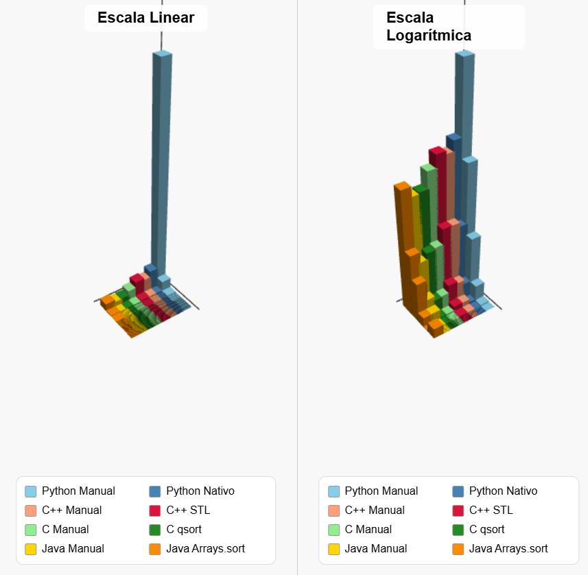

Los resultados reflejan diferencias marcadas entre los lenguajes analizados. Los lenguajes de bajo nivel muestras diferencias mínimas entre implementaciones, mientras que de alto nivel tienen diferencias notables, ya que las nativas de estas ultimas explotan optimizaciones en C o algoritmos superiores.

## Python 
En el caso de python, la diferencia es comica, hasta tuve que añadir una version en escala logaritmica para poder visualizar los datos correctamente solo por la implementación manual en python. Esto es porque la implementación nativa esta escrita en C. El python manual sufre la penalizacion del interprete en cada comparación y swap.

## C
C mantiene performance consistente entre manual y qsort. La diferencia es menor porque ambas implementaciones compilan a codigo nativo optimizado. qsort gana por estar mucho más optimizado, pero el manual no se queda muy atras. Es el lenguaje donde menos diferencia hay entre ambas.

## C++
C++ muestra performance casi identica entre manual y STL sort. La razón es que STL sort usa templates optimizados que el compilador puede inline agresivamente. Además, std::sort es introsort (quicksort + heapsort + insertion sort) que evita el peor caso O(n²).

## Java
Java tiene el comportamiento más errático. Para arrays pequeños, la implementacion manual es más rapida porque evita el overhead de Arrays.sort. Para arrays grandes, la optimizacion de la JVM sacan ventaja.