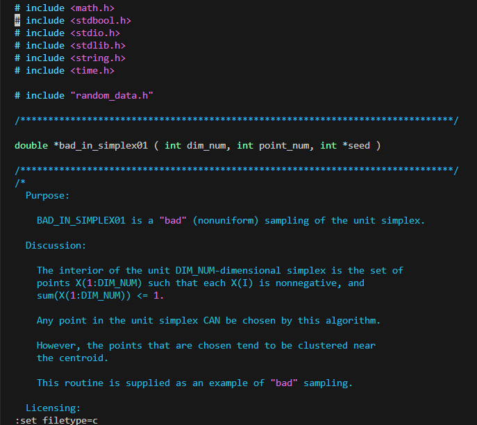
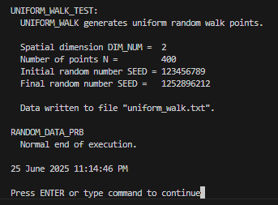
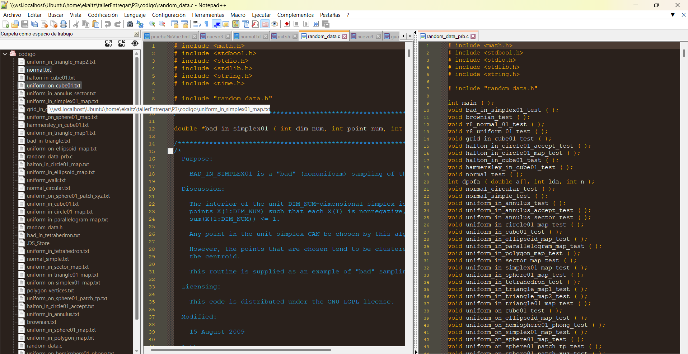
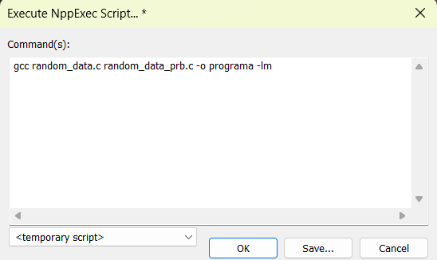
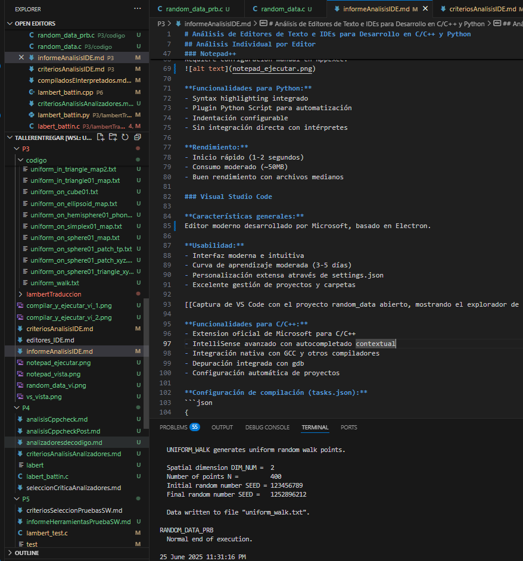
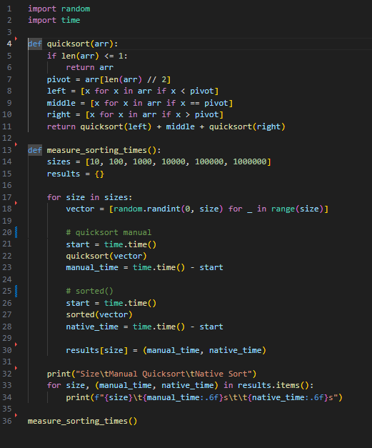

## Objetivos y Criterios de Evaluación

El objetivo es identificar las herramientas de edición más adecuadas para programación en C/C++ y Python, evaluando la relación funcionalidad-simplicidad, curva de aprendizaje, versatilidad multiplataforma y gratuidad/pirateabilidad.

## Análisis Individual por Editor

### Vim

**Características generales:**
Vim es un editor modal basado en comandos, derivado de vi, conocido por su eficiencia una vez dominado. Su filosofía se centra en la edición de texto sin uso del ratón, y sobrecargar los servidores de stackoverflow con usuarios preguntando como salir del editor.

**Usabilidad:**

- Curva de aprendizaje extremadamente pronunciada
- Interfaz minimalista basada en terminal
- Personalización ilimitada mediante archivos de configuración
- Tiempo de adaptación: 2-4 semanas para nivel básico (segun internet, a mi me parece una burrada de tiempo eso)




**Funcionalidades para C/C++:**

- Syntax highlighting nativo para C/C++
- Integración con GCC mediante comandos :make
- Autocompletado básico con Ctrl+N/P
- Plugin support: YouCompleteMe, coc.vim para autocompletado avanzado
- Navegación rápida entre funciones con ctags

**Compilación con GCC:**
```
:!gcc random_data.c random_data_prb.c -o programa -lm & ./programa
```



**Funcionalidades para Python:**

- Syntax highlighting integrado
- Indentación automática respetando PEP 8
- Integración con pylint y flake8
- Soporte para entornos virtuales

**Rendimiento:**

- Inicio instantáneo (< 100ms)
- Consumo mínimo de memoria (~10MB)
- Excelente con archivos grandes (>100MB)

### Notepad++

**Características generales:**
Editor gratuito para Windows con interfaz gráfica tradicional. Diseñado para ser simple pero funcional, popular entre programadores principiantes y usuarios de Windows.

**Usabilidad:**

- Interfaz familiar tipo Windows
- Curva de aprendizaje suave (1-2 días)
- Personalización limitada pero suficiente
- Gestión de pestañas intuitiva



**Funcionalidades para C/C++:**

- Syntax highlighting predefinido
- Autocompletado básico de palabras
- Integración limitada con compiladores externos
- Plugin NppExec para ejecutar comandos de compilación
- Búsqueda y reemplazo con expresiones regulares

**Compilación con GCC:**
Requiere configuración manual en NppExec:


**Funcionalidades para Python:**

- Syntax highlighting integrado
- Plugin Python Script para automatización
- Indentación configurable
- Sin integración directa con intérpretes

**Rendimiento:**

- Inicio rápido (1-2 segundos)
- Consumo moderado (~50MB)
- Buen rendimiento con archivos medianos

### Visual Studio Code

**Características generales:**
Editor moderno desarrollado por Microsoft, basado en Electron.

**Usabilidad:**

- Interfaz moderna e intuitiva
- Curva de aprendizaje moderada (3-5 días)
- Personalización extensa através de settings.json
- Excelente gestión de proyectos y carpetas



**Funcionalidades para C/C++:**

- Extension oficial de Microsoft para C/C++
- IntelliSense avanzado con autocompletado contextual
- Integración nativa con GCC y otros compiladores
- Depuración integrada con gdb
- Configuración automática de proyectos

**Configuración de compilación (tasks.json):**

```java
{
    "type": "cppbuild",
    "label": "C/C++: gcc build active file",
    "command": "/usr/bin/gcc",
    "args": [
        "-g",
        "${file}",
        "-o",
        "${fileDirname}/${fileBasenameNoExtension}"
    ]
}
```

Pero odio hacerlo asi. Mejor abrir terminar dentro del vscode.

**Funcionalidades para Python:**

- Extension oficial de Python
- Integración con intérpretes y entornos virtuales
- Debugging interactivo
- Linting automático (pylint, flake8)
- Soporte para Jupyter notebooks



**Rendimiento:**

- Inicio moderado (3-5 segundos)
- Consumo elevado (~200-400MB)
- Rendimiento variable según extensiones activas


## Tabla Comparativa de Editores

| Criterio | Vim | Notepad++ | Visual Studio Code |
|----------|-----|-----------|-------------------|
| **Usabilidad** |
| Curva de aprendizaje | Muy alta (2-4 semanas) | Baja (1-2 días) | Media (3-5 días) |
| Interfaz intuitiva | No (modal) | Sí (familiar) | Sí (moderna) |
| Personalización | Ilimitada | Limitada | Extensa |
| Navegación archivos | Comandos/plugins | Pestañas simples | Explorador integrado |
| **Funcionalidades C/C++** |
| Syntax highlighting | Excelente | Bueno | Excelente |
| Autocompletado | Plugin requerido | Básico | Avanzado (IntelliSense) |
| Integración GCC | Manual (:make) | Plugin NppExec | Nativa (tasks.json) |
| Depuración | Plugins externos | No integrada | Integrada con gdb |
| Refactoring | Limitado | No | Avanzado |
| **Funcionalidades Python** |
| Syntax highlighting | Nativo | Nativo | Excelente |
| Linting | Plugins | No integrado | Integrado |
| Entornos virtuales | Manual | No soportado | Automático |
| Debugging | Plugins | No | Integrado |
| Jupyter support | No | No | Nativo |
| **Rendimiento** |
| Tiempo inicio | <100ms | 1-2s | 3-5s |
| Uso memoria | ~10MB | ~50MB | 200-400MB |
| Archivos grandes | Excelente | Bueno | Variable |
| Estabilidad | Muy alta | Alta | Media-Alta |
| **Multiplataforma** |
| Windows | Sí | Solo Windows | Sí |
| Linux/Mac | Nativo | No | Sí |
| Sincronización | Manual | No | Cloud sync |
| **Extensibilidad** |
| Plugins disponibles | Miles | Cientos | Miles |
| Facilidad instalación | Manual | Gestor integrado | Marketplace |
| Calidad plugins | Variable | Variable | Alta |
| **Coste-Beneficio** |
| Precio | Gratuito | Gratuito | Gratuito |
| Recursos sistema | Mínimos | Bajos | Altos |
| Tiempo aprendizaje | Alto | Mínimo | Moderado |
