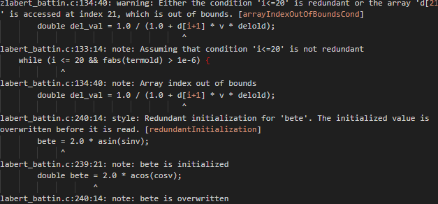

Se evaluan PVS-Studio y Cppcheck, siguiendo el marco de evaluación estabrecido en los criterios de selección. PVS-Studio representa una solución comercial avanzada, mientras que Cppcheck es una herramienta open source consolidada en el ecosistema de desarrollo C/C++.

## Criterios 

### Capacidades de Análisis

**PVS-Studio** Detecta errores sintácticos y semánticos con precision,identifica vulnerabilidades de seguridad mapeadas con OWASP y CWE, y realiza análisis profundo de calidad de código. Detecta y reduce memory leaks, e incorpora verificación de cumplimiento para estándares como MISRA C/C++ y AUTOSAR.

**Cppcheck** se enfoca en la deteccion de errores que los compiladores tradicionales no capturan. Cuenta con un analisis bidireccional de flujo de datos, permitiendo detectar bugs que otras herramientas pasan por alto. Pero no detecta tantas vulnerabilidades como PVS-Studio, centrándose principalmente en undefined behavior y errores clásicos de C/C++.

### Soporte de Lenguajes y Tecnologías

**PVS-Studio** soporta C, C++, C# y Java. Su cobertura de frameworks es amplia, especialmente en ecosistemas Windows y Linux. El análisis de código mixto está disponible, aunque con ciertas limitaciones en proyectos heterogéneos.

**Cppcheck** se especializa exclusivamente en C/C++. Su enfoque especializado permite un análisis más profundo dentro de su dominio, pero limita su aplicabilidad en proyectos multi-lenguaje.

### Precision y Rendimiento

**PVS-Studio** falsos positivos reducidos. El análisis incremental está bien implementado y el rendimiento es aceptable para proyectos medianos, aunque puede requerir recursos considerables al escalar el proyecto.

**Cppcheck** principalmente elimina falsos positivos, logrando tasas excepcionalmente bajas de estos. Su rendimiento es mejor que la de PVS-Studio. El análisis incremental funciona correctamente y el consumo de recursos es mínimo.

## Criterios de Usabilidad y Experiencia

### Facilidad de Uso

**PVS-Studio** necesita una configuración mas compleja, sobre todo para integrar con sistemas de build específicos. Los mensajes de eeror son detallados.

**Cppcheck** es bastante simple. La instalación es directa en todas las plataformas y funciona sin configuración adicional. Un solo comando ('cppcheck --enable=all') es suficiente para comenzar el análisis.

### Integracion con Herramientas de Desarrollo

**PVS-Studio** cuenta con plugins nativos para Visual Studio, IntelliJ IDEA, y otros IDEs principales. La integración con CI/CD está bien documentada, y soporta múltiples formatos de salida.

**Cppcheck** se integra con prácticamente cualquier entorno de desarrollo. Tiene soporte nativo en Eclipse, Visual Studio, CLion y muchos otros.

### Reporting y Visualizacion

**PVS-Studio** genera reportes profesionales en múltiples formatos (HTML, XML, JSON). Los reportes incluyen métricas detalladas, tendencias históricas y capacidades de filtrado avanzadas. La visualizacion es clara.

**Cppcheck** proporciona reportes funcionales pero básicos. Para análisis avanzado requiere procesamiento externo de los datos.

## Criterios Comerciales y de Sostenibilidad

### Modelo de Licencia y Costos

**PVS-Studio** opera bajo modelo comercial con licenciamiento por desarrollador o líneas de código. Los costos pueden ser significativos para equipos grandes. Ofrece versiones gratuitas limitadas para proyectos open source con restricciones específicas.

**Cppcheck** es completamente open source bajo licencia GPL v3. No tiene costos asociados y puede utilizarse libremente en entornos comerciales. La versión empresarial introduce funcionalidades adicionales bajo modelo comercial.

### Soporte y Comunidad

**PVS-Studio** proporciona soporte técnico profesional incluido en las licencias comerciales. La comunidad de usuarios es más pequeña pero activa en foros especializados.

**Cppcheck** cuenta con una comunidad open source robusta y activa. El soporte se basa en documentacion, foros comunitarios y GitHub issues. Las actualizaciones son frecuentes y la respuesta a bugs es rápida.

### Madurez y Estabilidad

**PVS-Studio** tiene más de 15 años en el mercado y esta presente en proyectos empresariales. Cuenta con respaldo empresarial de Viva64.

**Cppcheck** tiene más de 10 años de desarrollo continuo. La estabilidad es alta y es ampliamente adoptado en proyectos críticos. El desarrollo es transparente y colaborativo.

## Criterios de Seguridad y Compliance

### Capacidades de Seguridad

**PVS-Studio** ofrece cobertura completa de OWASP Top 10, deteccion de inyecciones SQL/XSS/Command, análisis de configuraciones de seguridad y verificacion de manejo de secretos. Su base de datos de vulnerabilidades se actualiza regularmente.

**Cppcheck** se centra en vulnerabilidades específicas de C/C++ como buffer overflows, use-after-free y double-free. Su cobertura de vulnerabilidades web y de aplicacion es limitada.

### Cumplimiento Normativo

**PVS-Studio** soporta múltiples estándares incluyendo MISRA C 2012/2023, AUTOSAR C++14, y proporciona reportes de compliance listos para auditorías. Las certificaciones de seguridad del producto están disponibles.

**Cppcheck** tiene soporte básico para MISRA C/C++ en su versión premium. El compliance reporting requiere configuracion adicional y procesamiento externo de resultados.

## Evaluacion Práctica

### Prueba con Cppcheck en labert_battin.c

Se ejecutó Cppcheck sobre el archivo labert_battin.c, demostrando su efectividad práctica:

**Errores críticos detectados:**

- `arrayIndexOutOfBoundsCond`: Posible acceso fuera de límites en array `d[21]` cuando `i+1=21`
- `redundantInitialization`: Variable `bete` inicializada y sobrescrita inmediatamente

**Mejoras de calidad detectadas:**

- Variables que pueden ser declaradas como `const` (`c[21]`, `d[21]`)
- Reducción de scope para variable `x`
- Parámetro `dm` puede ser `const`
- Función `add_vectors` no utilizada
- Variable `x` asignada pero nunca leída

**Análisis de resultados:**
Cppcheck detectó 1 error potencialmente crítico (buffer overflow) y 6 mejoras de calidad, con 0 falsos positivos. El análisis tomó menos de 1 segundo y requirió solo el comando `cppcheck --enable=all labert_battin.c`.
