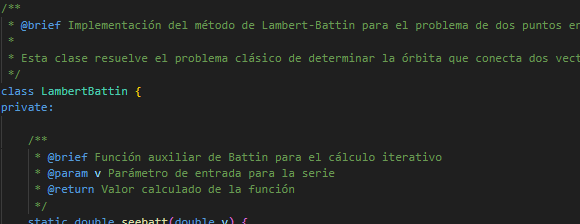
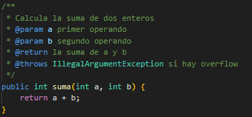
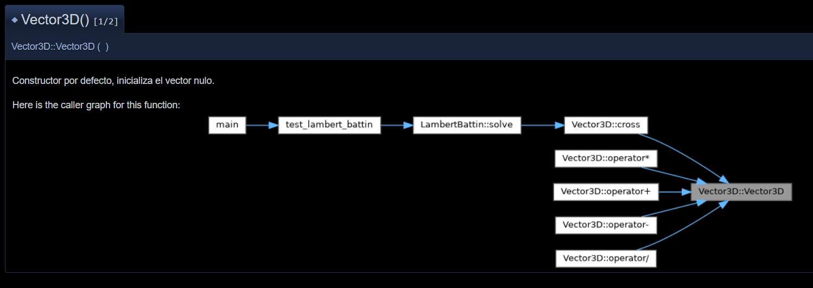

## Doxygen

### Facilidad de Instalación y Configuración

**Proceso de instalación:**

- En Windows: Descarga directa desde el sitio oficial o via chocolatey (`choco install doxygen`)
- En Linux: `sudo apt-get install doxygen` o equivalente según distribución
- En macOS: `brew install doxygen`
- Dependencias: GraphViz recomendado para diagramas
- Tiempo de instalación: 5 minutos

**Primera configuración:**

- Genera archivo Doxyfile con `doxygen -g`
- Funciona con configuración por defecto para proyectos básicos
- Requiere editar INPUT, OUTPUT DIRECTORY y PROJECT NAME como mínimo
- La configuración inicial es extensa pero bien documentada

**Integración con IDE:**

- Plugins disponibles para Visual Studio, Qt Creator, Code::Blocks
- Integración básica con la mayoría de IDEs modernos
- No requiere configuración especial del IDE

### Compatibilidad con Lenguajes de Programación

**Soporte C++:**

- Excelente reconocimiento de sintaxis C++
- Maneja correctamente templates, namespaces, herencia múltiple
- Soporta C++98 hasta C++20
- Reconoce automáticamente constructores, destructores, operadores

**Otros lenguajes:**

- Soporta C, Java, Python, C#, PHP, JavaScript
- Maneja bien proyectos multi-lenguaje
- Procesa archivos de cabecera (.h, .hpp) de forma nativa

### Sintaxis y Formato de Comentarios

**Aprendizaje de la sintaxis:**

- Sintaxis intuitiva basada en JavaDoc con extensiones
- Tiempo de aprendizaje: 2-3 horas para lo básico
- Pocas reglas fundamentales, muchas opciones avanzadas

**Flexibilidad del formato:**

- Múltiples estilos: `///`, `/** */`, `//!`, `/*! */`
- Soporte completo para HTML y LaTeX embebido
- Inclusión nativa de imágenes con `image`
- Soporte para diagramas DOT/GraphViz

### Características de la Documentación Generada

**Calidad visual:**

- Interfaz HTML profesional y navegable
- Estructura jerárquica clara con menús desplegables
- Búsqueda integrada eficiente
- Generación automática de gráficos de dependencias

**Formatos disponibles:**

- HTML (más usado y completo)
- LaTeX/PDF de alta calidad
- RTF, XML, Man pages
- HTML Help (CHM) para Windows

**Funcionalidades automáticas:**

- Índices alfabéticos automáticos
- Referencias cruzadas inteligentes
- Gráficos de herencia y colaboración
- Lista de archivos y espacios de nombres

### Personalización y Configuración Avanzada

**Opciones de personalización:**

- Más de 300 opciones de configuración en Doxyfile
- Temas CSS personalizables
- Headers y footers customizables
- Control granular sobre qué elementos incluir

**Control del contenido:**

- Filtros por patrones de archivos y directorios
- Exclusión de elementos privados/internos configurable
- Documentación condicional con @cond/@endcond

### Integración con Herramientas de Desarrollo

**Automatización:**

- Línea de comandos simple: `doxygen Doxyfile`
- Integración sencilla en Makefiles y scripts
- Funciona bien con Git hooks
- Soporte nativo para CMAKE

**CI/CD:**

- Ampliamente usado en pipelines de CI/CD
- Informes de warnings/errores estructurados
- Salida parseable para automatización

### Manejo de Proyectos Complejos

**Rendimiento:**

- Maneja proyectos de millones de líneas eficientemente
- Procesamiento incremental disponible
- Paralelización en sistemas multi-core
- Tiempo típico: 1-5 minutos para proyectos medianos

**Organización:**

- Estructura modular excelente
- Manejo correcto de dependencias complejas
- Soporte para múltiples packages/módulos

### Curva de Aprendizaje y Usabilidad

**Facilidad de uso:**

- Primera experiencia simple con configuración básica
- Mensajes de error claros y específicos
- Warnings informativos sobre elementos no documentados

**Recursos de aprendizaje:**

- Documentación oficial completa y bien estructurada
- Múltiples tutoriales de la comunidad
- Ejemplos extensos incluidos en la distribución

### Mantenimiento y Desarrollo Activo

**Estado del proyecto:**

- Comunidad muy activa en GitHub
- Resolución regular de bugs e issues

**Futuro de la herramienta:**

- Desarrollo continuo desde 1997
- Roadmap público disponible
- Compatible con nuevos estándares C++

### Casos de Uso Específicos

**Para proyecto Lamber:**

- Ideal para documentar APIs C++ complejas
- Excelente para arquitecturas con herencia múltiple
- Genera documentación técnica de alta calidad
- Maneja bien namespaces y templates

**Integración con estándares:**

- Compatible con Google Style Guide
- Funciona con la mayoría de coding standards
- No requiere modificaciones del código existente

### Conclusiones sobre Doxygen

**Puntos fuertes:**

- Herramienta madura y estable
- Excelente soporte para C++
- Documentación rica en funcionalidades
- Gran flexibilidad de configuración

**Limitaciones encontradas:**

- Curva de aprendizaje inicial para configuración avanzada
- Archivo de configuración puede ser abrumador
- Tiempo de procesamiento en proyectos muy grandes

---

## JavaDoc

### Facilidad de Instalación y Configuración

**Proceso de instalación:**

- Incluido en JDK, no requiere instalación separada
- Disponible desde línea de comandos inmediatamente
- Sin dependencias adicionales
- Tiempo de instalación: 0 (ya incluido)

**Primera configuración:**

- Funciona sin configuración previa
- Opciones por línea de comandos
- No requiere archivos de configuración específicos

**Integración con IDE:**

- Integración nativa en todos los IDEs Java
- Eclipse, IntelliJ, NetBeans lo soportan completamente
- Generación desde el IDE sin configuración

### Compatibilidad con Lenguajes de Programación

**Soporte C++:**

- **NO soporta C++ nativamente**
- Diseñado exclusivamente para Java
- No reconoce sintaxis C++

**Otros lenguajes:**

- Solo Java y documentos relacionados
- No procesa archivos C/C++
- Limitado a ecosistema Java

### Sintaxis y Formato de Comentarios

**Aprendizaje de la sintaxis:**

- Sintaxis muy simple y estándar
- Tiempo de aprendizaje: 30 minutos para lo básico
- Pocas etiquetas fundamentales (@param, @return, @throws)

**Flexibilidad del formato:**

- Solo formato `/** */`
- Soporte básico para HTML
- No soporta LaTeX ni imágenes complejas

### Características de la Documentación Generada

**Calidad visual:**

- Interfaz HTML estándar y familiar
- Diseño tradicional pero funcional
- Navegación por packages clara

**Formatos disponibles:**

- Solo HTML
- No genera PDF ni otros formatos nativamente

**Funcionalidades automáticas:**

- Índices automáticos básicos
- Referencias cruzadas simples
- Lista de clases y paquetes
- No genera gráficos automáticamente

### Personalización y Configuración Avanzada

**Opciones de personalización:**

- Opciones limitadas de personalización
- CSS básico modificable
- Pocas opciones de configuración comparado con Doxygen

**Control del contenido:**

- Control básico por packages
- Inclusión/exclusión de elementos privados
- Opciones limitadas de filtrado

### Integración con Herramientas de Desarrollo

**Automatización:**

- Integración directa con ant, maven, gradle
- Comando simple: `javadoc`
- Parte estándar del ecosistema Java

**CI/CD:**

- Ampliamente usado en pipelines Java
- Integración estándar en herramientas Java
- Reportes básicos de warnings

### Manejo de Proyectos Complejos

**Rendimiento:**

- Rápido para proyectos Java típicos
- Escalabilidad limitada comparado con Doxygen
- Procesamiento eficiente pero sin paralelización avanzada

**Organización:**

- Estructura por packages clara
- Manejo estándar de dependencias Java
- Limitado a patrones Java

### Curva de Aprendizaje y Usabilidad

**Facilidad de uso:**

- Extremadamente fácil de usar
- Parte estándar del desarrollo Java
- Sin configuración compleja

**Recursos de aprendizaje:**

- Documentación oficial de Oracle
- Ampliamente conocido por desarrolladores Java
- Múltiples tutoriales disponibles

### Mantenimiento y Desarrollo Activo

**Estado del proyecto:**

- Mantenido por Oracle como parte del JDK
- Actualizaciones regulares con cada versión Java
- Completamente estable

**Futuro de la herramienta:**

- Continuará siendo estándar en Java
- Evoluciona con el lenguaje Java
- Sin riesgo de obsolescencia

### Casos de Uso Específicos

**Para proyecto Lamber (C++):**

- **NO es aplicable** - JavaDoc no soporta C++
- Requeriría reescribir todo en Java
- No es una opción viable para el proyecto

**Integración con estándares:**

- Estándar de facto para Java
- No aplicable a proyectos C++

### Conclusiones sobre JavaDoc

**Puntos fuertes:**

- Simplicidad extrema
- Integración perfecta con ecosistema Java
- Estándar de la industria
- Sin configuración compleja

**Limitaciones encontradas:**

- Solo funciona con Java
- Opciones limitadas de personalización
- No genera documentación rica como Doxygen
